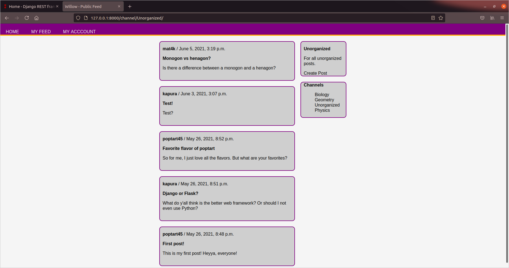

## Premise
A django-based social media app.

## Dependencies
Shapeshift uses Python3 along with a few packages that can be installed through the Python package manager `pip`:
* `django` for web framework
* `djangorestframework` for API

Usage requires standard django procedure:
* Create a django project and add `feed` folder into project directory
* Add `feed.apps.FeedConfig` and `rest_framework` to `INSTALLED_APPS` in `settings.py`
* Create a database and add information to `DATABASES` in `settings.py`